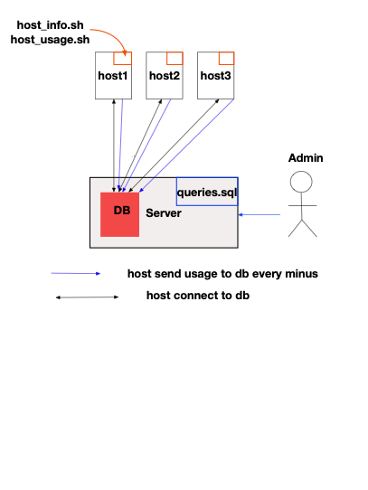

# Introduction

The Jarvis Linux Cluster Administration (LCA) team manages a Linux cluster of 10 nodes/servers which are running CentOS 7. These servers are internally connected through a switch and able to communicate through internal IPv4 addresses.

The LCA team needs to record the hardware specifications of each node and monitor node resource usages (e.g. CPU/Memory) in realtime (see appendix A). The collected data should be stored in an RDBMS database. LCA team will use the data to generate some reports for future resource planning purposes (e.g. add/remove servers).


# Quick Start

### initialize psql and run psql database (Server)

make sure you install docker and psql, after clone repository 

```bash
jarvis $ cd script
jarvis/script $ bash ./scripts/psql_docker.sh create [db_username][db_password]
jarvis/script $ bash ./scripts/psql_docker.sh start 
jarvis/script $ cd ../sql

```


### initialize database table and insert data(Node)

```bash
jarvis/sql $ psql -h [hostname] -p [port] -U [username] -f ddl.sql
jarvis/sql $ cd ../script
jarvis/script $ bash ./scripts/host_info.sh [psql_host] [psql_port] [db_name] [psql_user] [psql_password]
```


### set up crontab(Node)

```bash
$ crontab -e
# and adding following code
* * * * * bash [path to host_usage.sh] [hostname] [port] [db name] [username] [ user password] >> /tmp/host_usage.log
# for example
* * * * * bash /home/centos/Desktop/jarvis/script/host_usage.sh localhost 5432 host_agent postgres password >> /tmp/host_usage.log
```


### run query to get information

```bash
jarvis/sql $ psql -h [hostname] -p [port] -U [username] -f queries.sql
```


# \# Architecture Diagram


queries.sql can be executed not only in server but also hosts which connect to the DB



### Database & Tables

`host_info` :Hardware Specifications Data

|attribute|type|mean|
|----|----|----|
|id               | integer                     | primary key, host's id |
| timestamp        | timestamp without time zone | the time when host info inserts |
|total_mem        | integer                     | total memoery in KB |
|L2_cache         | integer                     | l2 cache |
|cpu_mhz          | integer                     | cpu mhz |
|cpu_model        | character varying(50)       | cpu model |
|cpu_architecture | character varying(20)       | cpu architecture |
|cpu_number       | integer                     | the number of cpu |
|hostname         | character varying(100)      | hostname, is also unique for each host |

`host_usage ` :Hardware Specifications Data

|attribute|type|mean|
|----|----|----|
|host_id               | integer                     | foreign key to host_info.id |
| timestamp        | timestamp without time zone | the time when host usage updates |
|memory_free        | integer                     | free memory in KB |
|cpu_idle         | integer                     | cpu idle in % |
|cpu_kernel          | integer                     | cpu kernel in % |
|disk_io        | integer | disk io |
|disk_available | integer | available disk in MB |


## Scripts

[psql_docker.sh](./script/host_info.sh) : `psql_docker.sh start|stop|create [db_username][db_password]` create a docker container or run/stop psql database

[host_info.sh](./script/host_info.sh) : `host_info.sh psql_host psql_port db_name psql_user psql_password` fetch hardware information and insert data into db

[host_usage.sh](./script/host_usage.sh) : `host_usage.sh psql_host psql_port db_name psql_user psql_password` fetch linux usage information and insert data into db

[ddl.sql](./sql/ddl.sql) : `psql -h  psql_host -p psql_port -d db_name -U psql_user -f ddl.sql` to generate a host_info and a host_usage table in db

[queries.sql](./sql/queries.sh) : `psql -h  psql_host -p psql_port -d db_name -U psql_user -f queries.sql` to get average memory usage and detect host failure


## Improvements

- write crontab setup into bash to auto set crontab

- write specific error message to log file when new host usage insertion failed

- make time intervation flexiable, admin is able to set time intervation to see average memory usage


