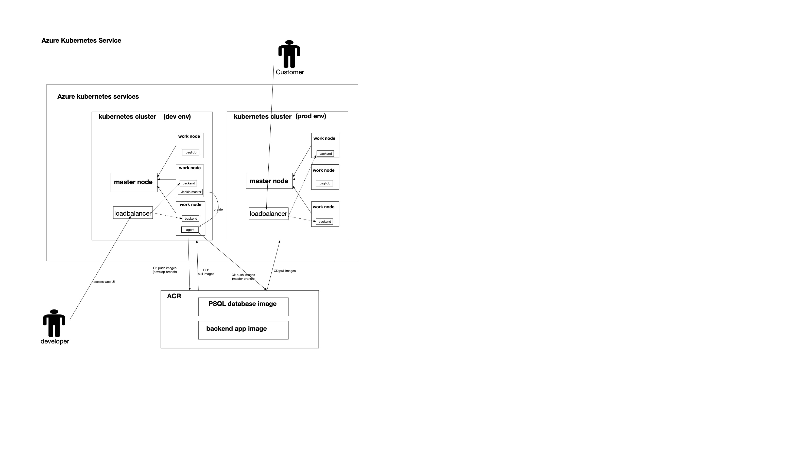
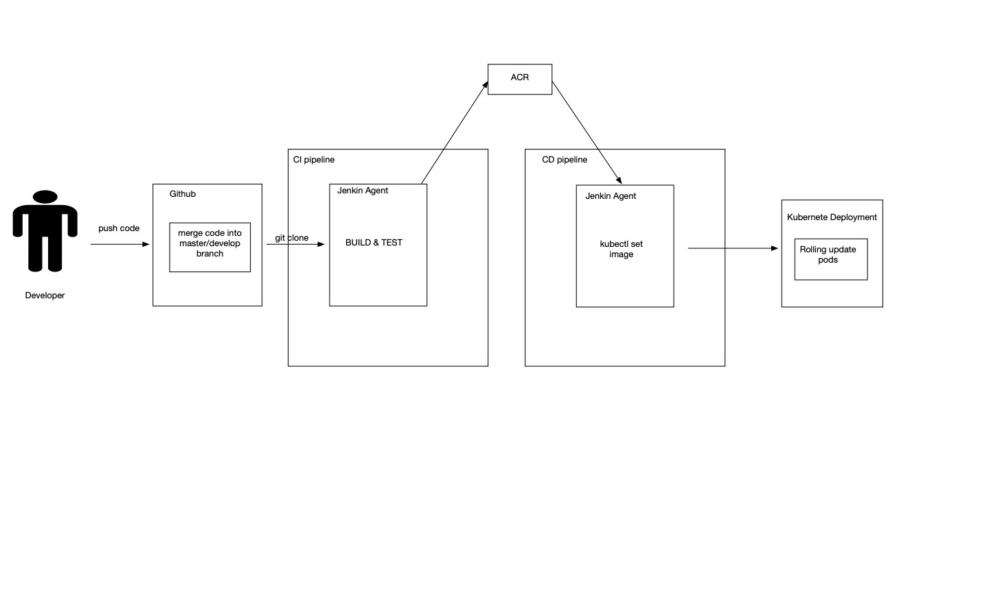

# Introduction 

The project is to deploy the trading app into azure kubernete service and uses the Jenkens to setup the CI/CD pipelines to help the team integrate and deploy the productions for operations departement.

- Dev/Prod environment
  - The projects has two kubernete clusters. The dev environment is used for testing the application and the real application will run in the prod enviroment.
- Kubernete
  - the backend application and database in the trading app are deployed into an azure kubernete service with a loader balance service.
  - in the kubernete cluster, we set two more replicas for the backend application pod with auto-scaling
- Azure container registry 
  - Instead of using the docker hub, we use the ACR to upload the docker images. 
  - The CI pipeline builds the docker images and push them into ACR and such images will be imported in the pods when kubernete performs a rolling update
- Jenkin
  - We create a Jenkin server in the kubernete cluster in azure, and create a load balance with the aim that we can access the web UI to build the pipelines.
  - We write the Jenkins file to defines the stages and steps in the CI and CD pipelines.

# Application Architecture

# Jenkins CI/CD pipeline

- CI pipeline steps:

  - git clone, fetch the GitHub repository with a specific branch like master or develop branch
  - azure login, log in azure account, connect with ACR 
  - az acr build, and go to the trading application folder. Use azure ACR build commands to build PSQL database image and backend application image with new tags and push them to ACR

- CD pipeline steps:

  - az aks get, connect to Azure Kubernetes Service
  - kubectl set image, use the set image command line to put the newest images in the deployment. And Kubernetes start a rolling update.

  

  # Improvements

  - Isolated the Jenkins server from dev env
  - Add unit tests and lint tests in the CI pipeline
  - Instead of using pipeline build number as image tags, use more meaningful tags to organize the images