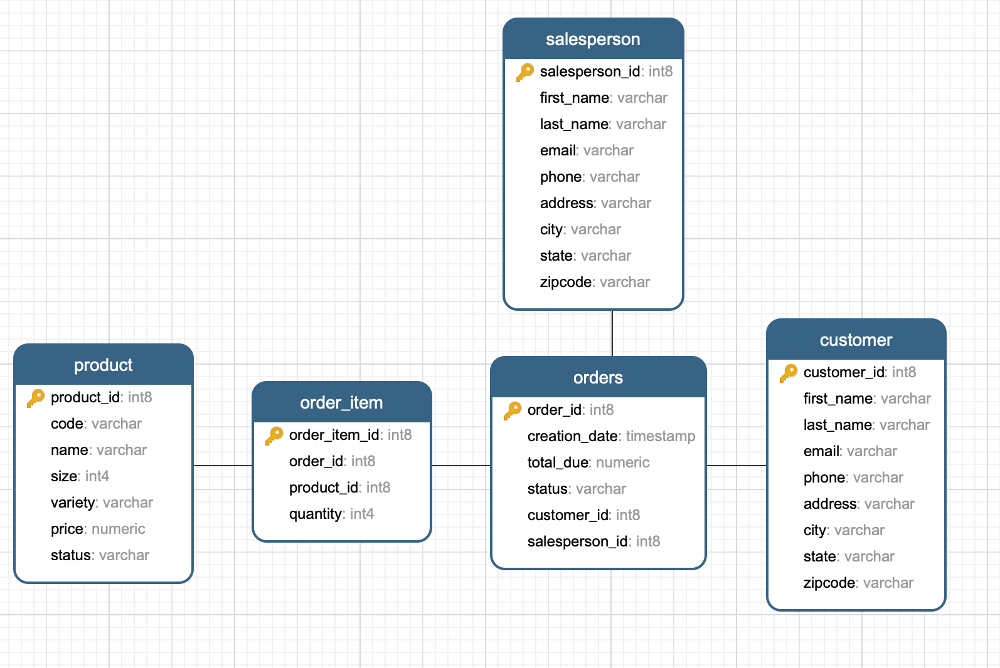

# Introduction
This is a learning ticket to learn how JAVA build a connection to PostgreSQL database
 and how to write DAO to fetch/update/delete entries in the database.

# ER Diagram
ER diagram

# Design Patterns
Repository is well wrapped API which is more OO than DAO. They both define how
to fetch/update/delete entries in the database. Repository modifies those entries
by the object's methods while DAO is writing the raw query to execute.