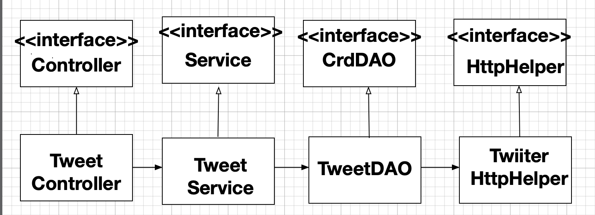

# Introduction
The Twitter Application is an MVC project using Java Spring Framework. It allows users to create, fetch, and delete Tweets by Twitter API. The project has two main parts: Models and Controllers. The project also uses Java Spring dependency management and uses docker to dockerize the project.

# Quick Start


Add enviroment variables.

```bash
$ vim env.sh

# add keys values like following

# export consumerKey=CSWEVADbaica21RVCXSHV 
# export consumerSecret=qweqRCVAJI4svcy
# export accessToken=sdaCFB2s1CDCHUEI321
# export tokenSecret=GCUBS57agcDHD

# And then run env.sh

$ source env.sh  
```


run application via terminal

```bash

$ mvn package -Dmaven.test.skip=true 
$ java -jar twitter*.jar post|get|delete [opitions]

```


run application via docker

```bash
$ mvn package -Dmaven.test.skip=true
$ docker build -t [name] .
$ docker run --rm \
-e consumerKey=[YOUR_VALUE] \
-e consumerSecret=[YOUR_VALUE] \
-e accessToken=[YOUR_VALUE] \
-e tokenSecret=[YOUR_VALUE] \
[name] post|get|delete [option]

```


Command lines

`post [text] [lat] [lon]`

`get [id]`

`delete [id]`


# Design


- Data Access Layer: TweetDAO

- - TweetDAO has the CREATE/GET/DELETE methods to call twitter API via HttpHelper.
  - TweetDAO handles POJO (Tweet).

- Service Layer: TweetService

- - The TweetService takes the business logic before or after calling TweetDAO.

- Controller: TweetController

- - interacts and validate CLI args, and then call the Service layer to get the result.

# Models

There are 5 Models in this Application

- Tweet: contains all information about a tweet, including idStr, id, created_at, text, `Coordinate`, `Entity`, reTweetCount, favoriteCount, retweeted, favorited
- UserMention: name, indices, screenName, id, idStr
- Coordinate: type, coordinates
- Entity: `UserMention`, `hashTags`
- HashTag: text, indices

# Spring
- I use inversion of control and dependency injection in Java Spring Framework to handle dependency management problems. I use the annotation @Repository @Controller @Component @Service to define the Java Bean class and use @Autowired to tell java Spring the relation between classes. Then I create TwiiterCLICompoenntScan to define the configuration of the application's context. And TwitterCLISpringBoot class set up the twitter application.

# Docker
1. Use the command line `mvn package ` to build a uber jar.
2. Dockerfile contains the configuration about how to run the application inside the docker container
3. Build the docker image via `docker build -t [name] .`
4. Run docker image as container while passing environment variables

# Improvements
- We can have a better validation of id via using Twitter API.
- we should not only allow fetching tweet by id, but we should also allow getting tweet by searching keywords
- Add more service/DAO for different POJO like Coordinates, Entity.
