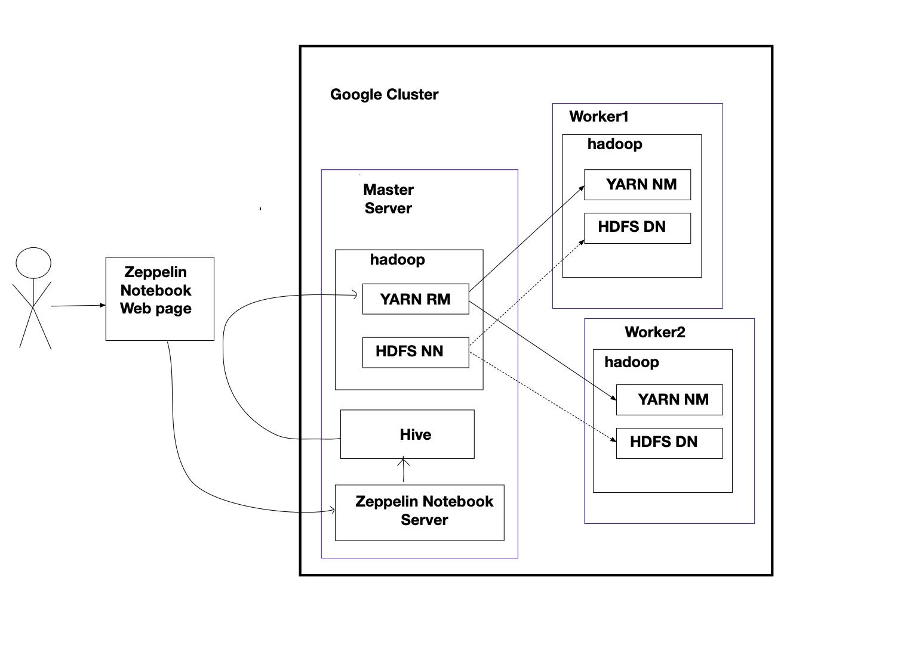

- # Introduction

  The project is to collect and insert big data into different Hadoop cluster tables in the google cloud platform. Using Apache Hive and Zeppelin Notebook to write quries helps the data analytics team to solve bussiness problems.

  # Hadoop Cluster

  - cluster architecture diagram

    

  - **Hadoop**: has three main components, HDFS, YARN, MapReduce.

    - - HDFS: is to store data files. HDFS consists of one NameNode and multiple DataNode. Each file will be split into various blocks and kept three copies of each block into different DataNodes. The NameNode will track those block locations.

    - - YARN: is to manage containers and allocate resources for the tasks. The Resource Manager will check resources in different worker nodes via the NodeManagers; the Application Manager will create containers and run the jobs.

    - - MapReduce: is the process of mapping, shuffling and reducing data. 

  - **Hive:** Hive is the part to help developers to write SQL to let Hadoop do some MapReduce tasks. It will convert SQL query into MapReduce or TEZ jobs by YARN, and Hadoop will run such jobs.

  - **Zeppelin**: Zeppelin Notebook is a UI interface to help the user write and run different scripts. It connects to multiple interpreters like Hive, Spark and so on. And when the user writes some hive SQL, it will let hive run such SQL query and display the results.

  # Hive Project

  - The Hive project is to demonstrate how to creat tables and transfer data from table to table and then use big data to fetch information to solve business problem.  
    - use `OpenCSVSerde` and` view` table to parse and show data from GS location
    - optimize query by using `partition` and reduce hdfs file size via `parquet`
    - write complex quries to solve business problem 

  

  more detail in `hadoop.pdf` file

  

  

  

  # Improvements

  - add more work nodes to improve the performance.
  - use bucketing and compare bucketing and partition
  - use spark sql instead of hive

