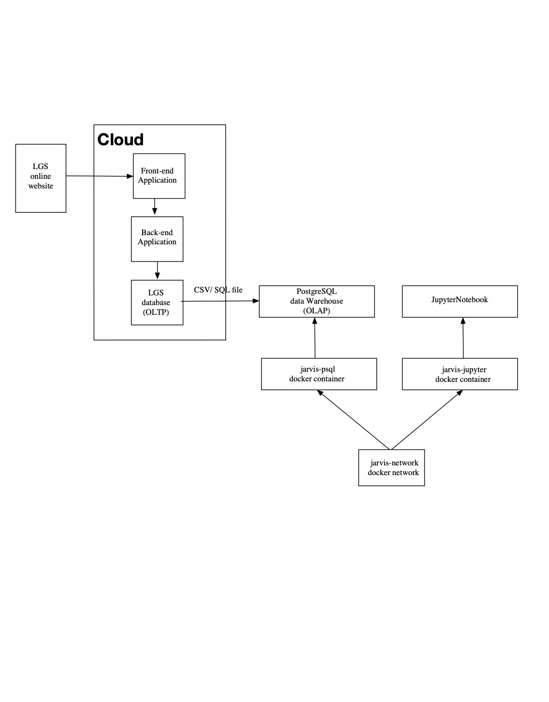

# Introduction
The project is a PoC project that stores data between 01/12/2009 and 09/12/2011 from London Gift Shop (LGS),
a UK-based online store, into PSQL data warehouse. As a software developer, I am responsible for writing a
JupyterNotebook using Python libraries, including pandas, NumPy, Matplotlib. The project extracts useful information
and visualizes them as histograms, line plots, boxplots, and tables in the notebook. The project also helps the LGS
marketing by analyzing data, answering specific business questions, and digging some potential marketing.

# Project Architecture

- LGS deploys its front-end application, back-end application and database on the cloud.

- When a customer places an order, it goes through the front-end application, sending API requests to the back-end application. 
  - After doing some business logic process in the back-end application, the database's transaction stores via OLTP.
  - The data in the LGS database exports as CSV or SQL file. 

- The Jarvis project contains two primary containers, a jarvis-psql container and a jarvis-jupyter container.

- The jarvis-network connects the jarvis-psql container and the jarvis-jupyter container.
  - The jarvis-psql has a PostgreSQL data warehouse
  - The jarvis-jupyter contains JupyterNotebook server, which loads data from the PostgreSQL data warehouse

# Data Analytics and Wrangling
- [NoteBook](./retail_data_analytics_wrangling.ipynb) 

- **Total Invoice Amount Distribution**

  - display the order invoice amount distribution with its mean, min, max, median, mode

- **Monthly Placed and Canceled Orders**

  - analyze the placed and cancelled orders from 2009-12 to 2011-12

- **Monthly Sales and Growth**

  - LGS had a big decrease in Sale and Growth at 2011-01 and 2011-12
  - LGS increased significantly 2010-03 , 2011-03, 2011-05, 2011-09 with around 0.4% growth

- **Monthly Active Users and New and Existing Users**

  - from 2010 to 2011, the new customer keeps below 200.
  - exists customers stay stable from 2019 to 2011

- **Finding RFM and RFM Segmentation**

  - RFM is a method used for analyzing customer value with three dimensions, recency, frequency and monetary.
  - assign customers different tags based on one RFM score

- - compute the mean, count for different customer groups

# Improvements
- visualize customer with different RFM Segmentation tags via pie chart
- use RFM to give LGS some potential marketing suggestions
- build the pipeline to get new data from the LGS database automatically