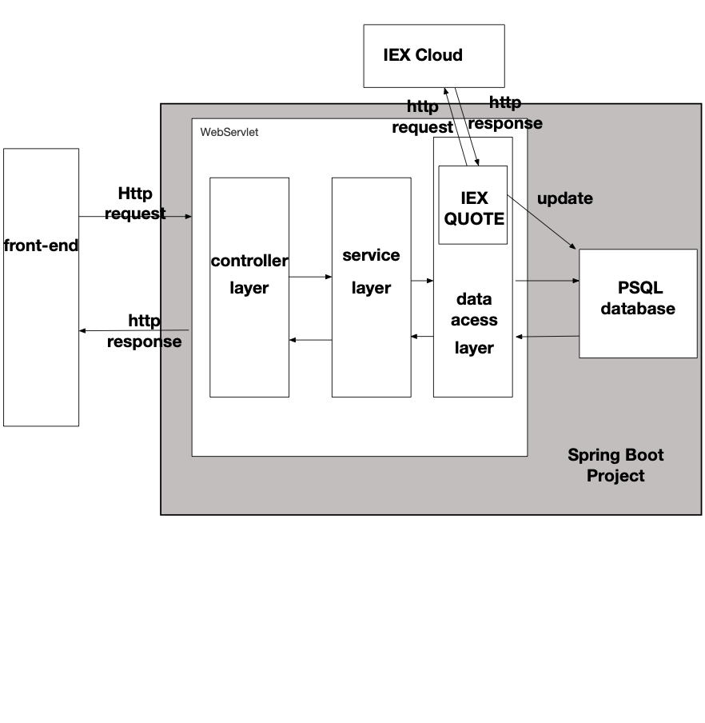
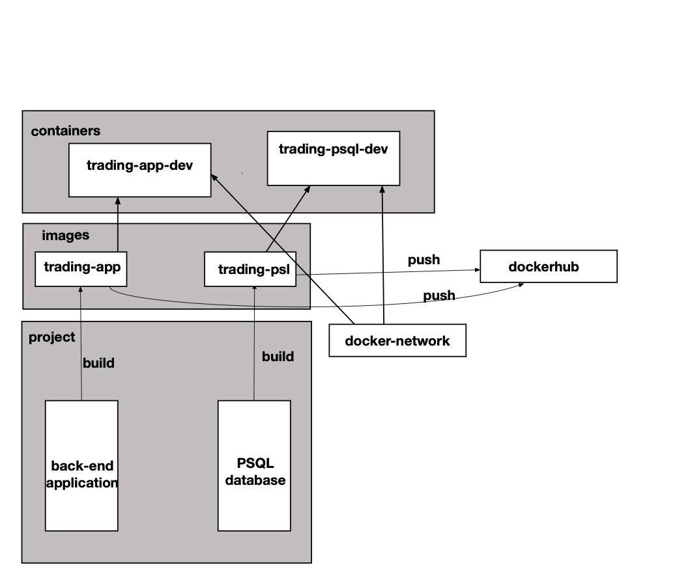

# Introduction
- SpringBoot project is an online trading simulation. This project is proof of concept, using a new microservice architecture. It is a back-end server, and it provides a restful API to allow the customer to buy or sell stocks.
- The project has two main parts, the back-end application and the database. The database in this project is PostgreSQL.
- The back-end application uses the MVC pattern, and it also uses java spring-boot. The application contains three layers; the first layer is the data access layer, connecting to the database and fetches or updating data information. The second layer is the service layer, where the application handles the business logic. The last later is the controller layer. We define the restful APIs in this layer, receive an HTTP request, and return an HTTP response.
- We have a trading service to handle the trading process, and we also have a quote service to call the IEXCloud to update stock market information and update our database.
- The project contains both unit tests and integrating tests. Also, the team tests the restful API by postman manually. We are using Docker to deploy the back-end application and database separately. It helps us to organize and maintain the project.

# Quick Start

Initialize the database application

```bash
cd ./springboot/psql
docker build -t trading-psql .  #docker builds ./Dokcerfile by default
```


Initialize the back-end application

```bash
cd ./springboot/
docker build -t trading-app . #docker builds ./Dokcerfile by default
```


Run the database

```bash
docker run --name trading-psql-dev \
-e POSTGRES_PASSWORD=${password} \
-e POSTGRES_DB=${database_name} \
-e POSTGRES_USER=${username} \
--network ${network} \
-d -p 5432:5432 trading-psql
```


Run the application

```bash
docker run --name trading-app-dev \
-e "PSQL_HOST=trading-psql-dev" \
-e "PSQL_USER=${username}" \
-e "PSQL_PASSWORD=${password}" -e "PSQL_PORT=5432" -e "PSQL_DB=${database_name}" \
-e "token=${your_token}" \
--network ${network} \
-p 5000:5000 -t trading-app
```


# Architecture



- Controller layer: it contains restful APIs. it firstly receives the HTTP requests, and then call service layers, and finally returns the HTTP responses
- Service layer: it handles the business logic and returns the results to the controller.
- DAO layer: It connects to the database. It fetches or updates data information and serialize or deserialize java objects.
- SpringBoot: it contains Ioc to handles the dependency management problem by auto-injection. It defines three layers defined by annotations. It also has tomcat to receive an HTTP request, and the start servlet and assigns HTTP request to a specific controller method by the URI path.
- PSQL: database contains user information, stock market information and order information.
- IEX: the remote cloud contains stock market information.


# REST API Usage
## Swagger
Swagger is an API development to simplify API documents for developers. It provides a java library to auto-generate API documents and UI web page. The back-end and front-end developers can directly read and test them.
## Quote Controller
- Quote Controller has two main tasks. One is to fetch stock market information from IEX icloud and save such information into PSQL database. Another task is to handle business logic about account and trader and placing orders.
- `GET /quote/iex/ticker/{ticker}` get IEX quote by symbol(ticker)
- `PUT /quote/iexMarketData` access IEX clould to update all ticker that are stored in PSQL database.
- `PUT /quote` save a quote. quote information is in http request body.
- `POST /quote/tickerId/{tickerId}` save a new quote by ticker
- `GET /quote/dailyList` display all quote stored in PSQL database
## Trader Controller
- Trader Controller is to create an trader account. Controller also is able to deposit or withdraw the amount.
- `POST /trader/firstname/{firstname}/lastname/{lastname}/dob/{dob}/country/{country}/email/{email}` is to create a new trader and new account
- `POST /trader` is to create a new trader and new account. The account information is stored in http request body.
- `DELETE /trader/traderId/{traderId}` delete trader and account only if account has no position and 0 amount.
- `PUT /trader/deposit/traderId/{traderId}/amount/{amount}` is to deposit an amount money to account.
- `PUT /trader/widthdraw/traderId/{traderId}/amount/{amount}` is to widthdraw an amount money from account.
##Order Controller
- Order Controller is to execute a buying order or a selling order. 
- `POST /order/marketOrder` the order information is stored in request body. This API method is to handle buyer order or seller order.
# Docker Deployment



##### PSQL database image:

extends the postgres:9.6-alpine image and calls schema.sql to initialize database.

```dockerfile
FROM postgres:9.6-alpine

ADD schema.sql /docker-entrypoint-initdb.d/

ENTRYPOINT ["docker-entrypoint.sh"]
CMD ["postgres"]
```


##### back-end application image:

uses maven and openjdk images to build jar package. And then use jdk to run jar package.

```dockerfile

FROM maven:3.6-jdk-8-slim AS build
COPY src /build/src
COPY pom.xml /build/
RUN mvn -f /build/pom.xml clean package -DskipTests


FROM openjdk:8-alpine
COPY --from=build /build/target/trading-1.0-SNAPSHOT.jar /usr/local/app/trading/lib/trading_app.jar
ENTRYPOINT ["java","-jar","/usr/local/app/trading/lib/trading_app.jar"]
```


##### Run the database as a container

```bash
docker run --name trading-psql-dev \
-e POSTGRES_PASSWORD=${password} \
-e POSTGRES_DB=${database_name} \
-e POSTGRES_USER=${username} \
--network ${network} \
-d -p 5432:5432 trading-psql
```


##### Run the application as acontainer

```bash
docker run --name trading-app-dev \
-e "PSQL_HOST=trading-psql-dev" \
-e "PSQL_USER=${username}" \
-e "PSQL_PASSWORD=${password}" -e "PSQL_PORT=5432" -e "PSQL_DB=${database_name}" \
-e "token=${your_token}" \
--network ${network} \
-p 5000:8080 -t trading-app
```


# Improvements

- Allow a trader to have multiple accounts.
- Write an API to display the order history.
- Add a "Follow" table, which allows a trader to track specific stocks. The trader can check his or her favourite tickers.
- Add a thread to continue to call IEX cloud API to update the "Quote" market.
- Support the limit order and stop order on the platform so that traders can have more options.

