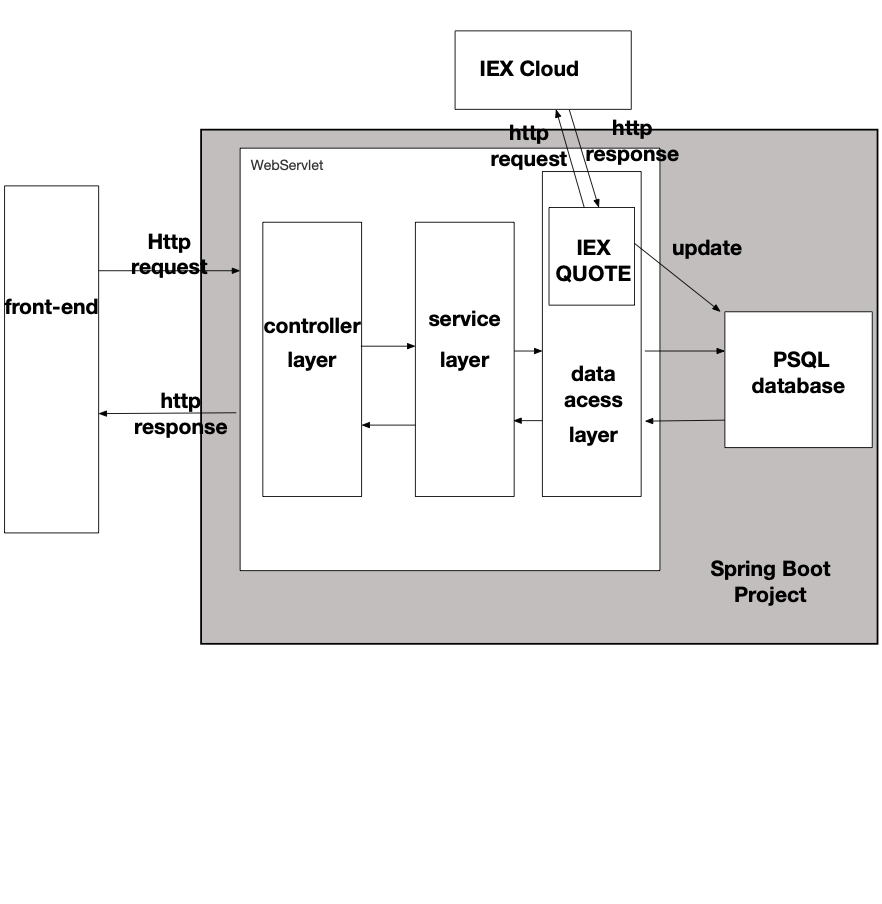

# Introduction
- SpringBoot project is an online trading simulation. This project is proof of concept, using a new microservice architecture. It is a back-end server, and it provides a restful API to allow the customer to buy or sell stocks.
- The project has two main parts, the back-end application and the database. The database in this project is PostgreSQL.
- The back-end application uses the MVC pattern, and it also uses java spring-boot. The application contains three layers; the first layer is the data access layer, connecting to the database and fetches or updating data information. The second layer is the service layer, where the application handles the business logic. The last later is the controller layer. We define the restful APIs in this layer, receive an HTTP request, and return an HTTP response.
- We have a trading service to handle the trading process, and we also have a quote service to call the IEXCloud to update stock market information and update our database.
- The project contains both unit tests and integrating tests. Also, the team tests the restful API by postman manually. We are using Docker to deploy the back-end application and database separately. It helps us to organize and maintain the project.

# Quick Start

Initialize the database application

```bash
cd ./springboot/psql
docker build -t trading-psl .  #docker builds ./Dokcerfile by default
```


Initialize the back-end application

```bash
cd ./springboot/
docker build -t trading-app . #docker builds ./Dokcerfile by default
```


Run the database

```bash
docker run --name trading-psql-dev \
-e POSTGRES_PASSWORD=${password} \
-e POSTGRES_DB=${database_name} \
-e POSTGRES_USER=${username} \
--network ${network} \
-d -p 5432:5432 trading-psql
```


Run the application

```bash
docker run --name trading-app-dev \
-e "PSQL_HOST=trading-psql-dev" \
-e "PSQL_USER=${username}" \
-e "PSQL_PASSWORD=${password}" -e "PSQL_PORT=5432" -e "PSQL_DB=${database_name}" \
-e "token=${your_token}" \
--network ${network} \
-p 5000:8080 -t trading-app
```


# Architecture



- Controller layer: it contains restful APIs. it firstly receives the HTTP requests, and then call service layers, and finally returns the HTTP responses
- Service layer: it handles the business logic and returns the results to the controller.
- DAO layer: It connects to the database. It fetches or updates data information and serialize or deserialize java objects.
- SpringBoot: it contains Ioc to handles the dependency management problem by auto-injection. It defines three layers defined by annotations. It also has tomcat to receive an HTTP request, and the start servlet and assigns HTTP request to a specific controller method by the URI path.
- PSQL: database contains user information, stock market information and order information.
- IEX: the remote cloud contains stock market information.


# REST API Usage
## Swagger
Swagger is an API development to simplify API documents for developers. It provides a java library to auto-generate API documents and UI web page. The back-end and front-end developers can directly read and test them.
## Quote Controller
- Quote Controller has two main tasks. One is to fetch stock market information from IEX icloud and save such information into PSQL database. Another task is to handle business logic about account and trader and placing orders.
- briefly explain each endpoint
  e.g.
  - GET `/quote/dailyList`: list all securities that are available to trading in this trading system blah..blah..
## Trader Controller
- High-level description for trader controller (e.g. it can manage trader and account information. it can deposit and withdraw fund from a given account)
- briefly explain each endpoint
##Order Controller
- High-level description for this controller.
- briefly explain each endpoint
## App controller
- briefly explain each endpoint
# Docker Deployment
- docker diagram including images, containers, network, and docker hub
e.g. <https://www.notion.so/jarviscanada/Dockerize-Trading-App-fc8c8f4167ad46089099fd0d31e3855d#6f8912f9438e4e61b91fe57f8ef896e0>
- describe each image in details (e.g. how psql initialize tables)

# Improvements
If you have more time, what would you improve?

- at least 5 improvements